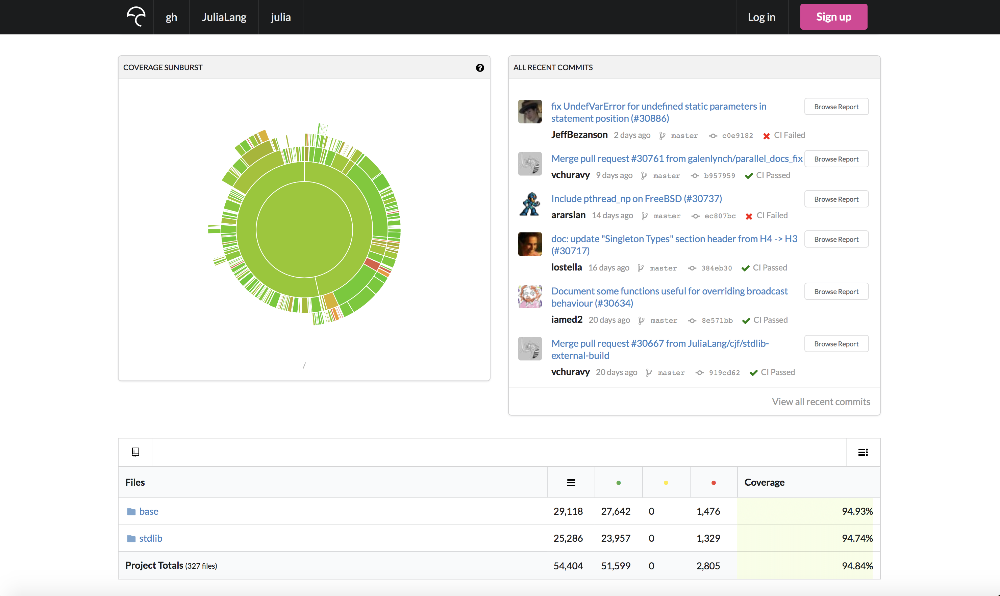
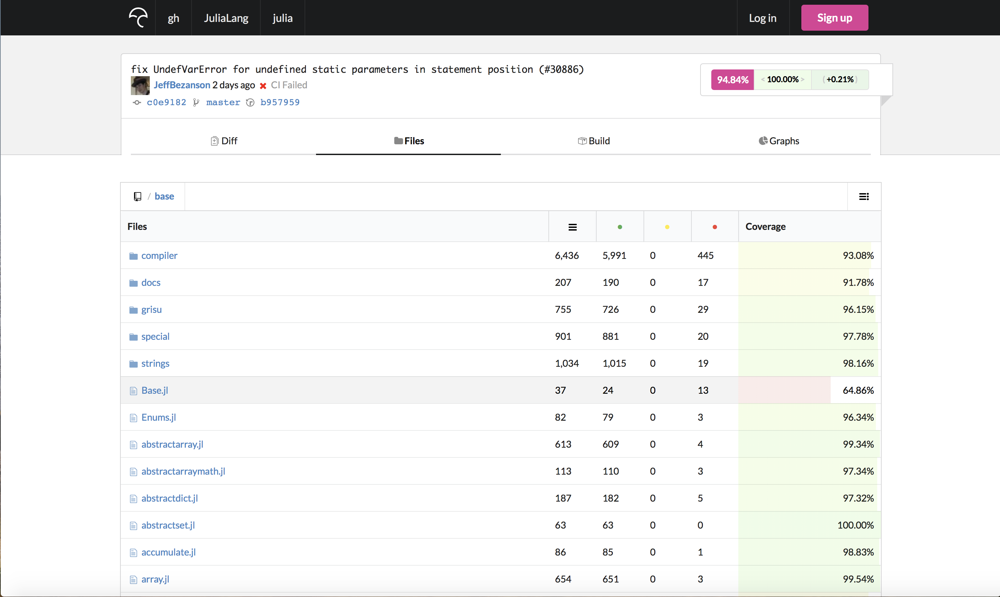
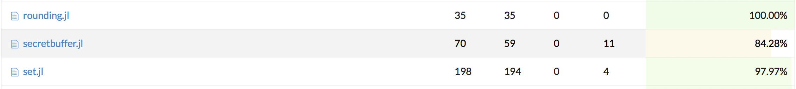
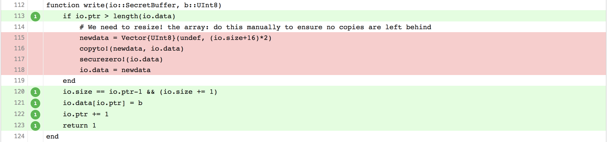
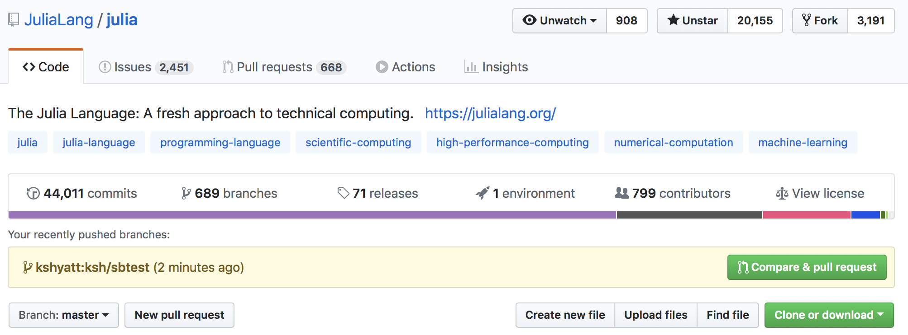
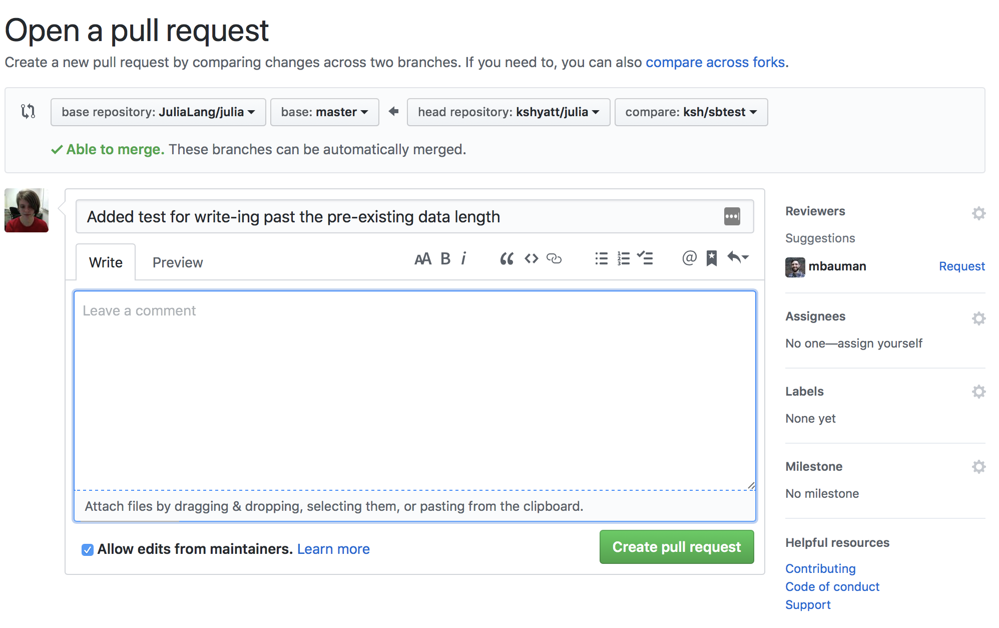
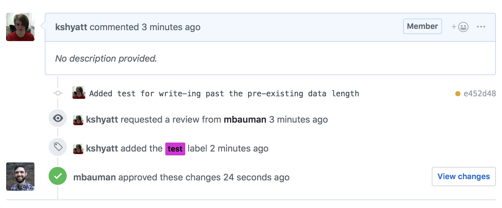

+++
title = "Making a first Julia pull request"
date = 2019-01-31T13:39:26-05:00
draft = false

# Authors. Comma separated list, e.g. `["Bob Smith", "David Jones"]`.
authors = ["Katharine Hyatt"]

# Tags and categories
# For example, use `tags = []` for no tags, or the form `tags = ["A Tag", "Another Tag"]` for one or more tags.
tags = []
categories = []

# Projects (optional).
#   Associate this post with one or more of your projects.
#   Simply enter your project's folder or file name without extension.
#   E.g. `projects = ["deep-learning"]` references 
#   `content/project/deep-learning/index.md`.
#   Otherwise, set `projects = []`.
# projects = ["internal-project"]

# Featured image
# To use, add an image named `featured.jpg/png` to your page's folder. 
[image]
  # Caption (optional)
  caption = ""

  # Focal point (optional)
  # Options: Smart, Center, TopLeft, Top, TopRight, Left, Right, BottomLeft, Bottom, BottomRight
  focal_point = ""
+++

In this post I'm going to go through my step-by-step process of finding some code in base Julia which is not covered by tests, adding tests which do cover it, checking to make sure the tests pass, and finally opening a pull request to have my changes merged in to Julia itself. We'll be working off commit `0b0a394b3e7741d38f00dbb29895b6ba6a7d0767` if you want to follow along. I do almost all my development on macOS and Linux, so some of the shell commands will be a little different if you're on Windows.

# Prereqs
To get started, we're going to need a few things:

  - Some basic `git` knowledge: `git add`, `git clone`, `git commit`, `git checkout`, and `git push`. If you need an introduction to `git`, some decent options are:
    - [The GitHub help pages](https://help.github.com/articles/git-and-github-learning-resources/)
    - [The official git docs](https://git-scm.com/docs)
    - [The codecademy intro to git tutorial](https://www.codecademy.com/learn/learn-git), which is free
  - A source build of Julia, from `git clone git@github.com:JuliaLang/julia.git` (I use SSH, HTTPS is fine too)
  - A fork of Julia, since most people making their first pull requests will not have the ability to push branches to the main julia repository.

# Zeroth Step: Setting Up Our Fork

Having [forked](https://help.github.com/articles/fork-a-repo/) the [main julia repository](https://github.com/julialang/julia) to your GitHub account, you're ready to create a local [clone](https://git-scm.com/docs/git-clone) and let it know about both the upstream repos.

I usually clone julia into a subdirectory of my home directory called `projects`, so that on a new machine what happens is:
```bash
cd ~ # move to the home directory
mkdir -p projects # create the projects directory if it doesn't already exist, otherwise do nothing
cd projects # move to the kshyatt/projects directory
git clone git@github.com:JuliaLang/julia.git
```
This will copy the repository from GitHub, including the current state of all the source code as well as all its history. We can look at the *remotes* of our clone to see other copies of the julia repository our clone is aware of (can fetch/pull/push against). Since we cloned from GitHub, the repository already knows about it:
```bash
~/projects $ cd julia # move down into the julia directory post clone
~/projects/julia $ git remote -v # list remotes and their URLs
origin	git@github.com:JuliaLang/julia.git (fetch)
origin	git@github.com:JuliaLang/julia.git (push)
```
So our repository knows about its "parent". But we probably don't have the ability to write directly to the main Julia repositiory (yet -- who knows what the future holds?), which means we won't be able to create our own branches there. Instead, we will need to use a repository copy we do have the ability to write to -- our fork -- to make our coming changes visible to the wide world. If we cloned from the JuliaLang repo, we need to add another remote for our fork. Usually this will have a URL like: `https://github.com/$USERNAME/julia.git` or `git@github.com:$USERNAME/julia.git` where `$USERNAME` is your GitHub username. To let `git` know about the second remote, we use [`git remote add`](https://git-scm.com/docs/git-remote):
```bash
git remote add $REMOTE_NAME git@github.com:$USERNAME/julia.git
```
`$REMOTE_NAME` is the *local* alias we want to call the second remote by. The remote we cloned from (JuliaLang) gets the alias `origin`. You can pick any alias you like which doesn't conflict with an existing one. I often use `kshyatt` because even in the grim depths of 3:24am I can usually remember my own name. So when I do the remote add, it looks like:

```bash
git remote add kshyatt git@github.com:kshyatt/julia.git
```

And afterwards, if we look at the remotes `git` knows about:

```bash
~/projects/julia $ git remote -v # list remotes and their URLs
kshyatt	git@github.com:kshyatt/julia.git (fetch)
kshyatt	git@github.com:kshyatt/julia.git (push)
origin	git@github.com:JuliaLang/julia.git (fetch)
origin	git@github.com:JuliaLang/julia.git (push)
```

With a fork and local knowledge of it, we're ready to find some changes to make.

# The Hunt for Red Lines

There are many kinds of contributions a person can make to an open source project:

  - New features
  - Performance improvements
  - Bug fixes
  - Test coverage
  - Documentation improvements
  - Usage examples

If you're just starting out contributing to Julia, and don't have an obvious idea for a feature or a performance enhancement you could write, writing tests or improving docs are a great way to get started. People often disagree about the desirability of a new feature but I almost never see anyone say we should have fewer tests! Writing tests is a good way to learn how Julia works -- or doesn't, if you find a bug. We don't want to write tests just for the sake of having them, though -- we want to test as many julia features as possible in as little time as possible. If we're writing new tests, it's always a good idea to keep the test coverage in mind. Test coverage measures which lines of base (and stdlib) Julia are exercised by the tests. We keep this information current at [codecov](https://codecov.io/gh/julialang/julia). Here's a screenshot:



We can see the attractive sunburst picture, and a history of recent commits showing their total coverage percentage. On a lark, I picked `base/` to go hunting for uncovered lines.



Here we see each file, with its total lines, covered lines, uncovered lines, and coverage percentage. If we want to increase coverage, we want to pick a file with less than 100% of its lines covered. Keep in mind that these numbers may be less than the true coverage, because right now the coverage-enabled runs of the tests are all done on Unix and some code in Julia is Windows or BSD specific. Tests for such code aren't run by the coverage measurement script.

I happened to scroll down until I came across `base/secretbuffer.jl`. This file had a lot of uncovered lines, so I thought I had a decent chance of finding some code I could write tests to cover:



Clicking on the Codecov link opens up an annotated version of the source file, with green coloring representing lines which are covered by tests, and red coloring representing lines which are not. Scrolling down the file, I came across the `write` method, which writes some data packed into a `UInt8` into the secret buffer's data:



In order to test this, it would probably be good to have some sense of what it does. Having been using Julia since 2015, I probably have a bad heuristic for how easy this is to understand -- if you are looking at it and can't figure it out in about 5 minutes, there's absolutely no shame in logging onto the [Julia Slack](https://julialang.slack.com/) and asking! We have `#my-first-pr` and `#helpdesk` channels exactly for this. The type itself is defined earlier in the file:

```julia
mutable struct SecretBuffer <: IO
    data::Vector{UInt8}
    size::Int
    ptr::Int

    function SecretBuffer(; sizehint=128)
        s = new(Vector{UInt8}(undef, sizehint), 0, 1)
        finalizer(final_shred!, s)
        return s
    end
end
```

My attempt at an explanation

  - `SecretBuffer`, like the name implies, is a type which contains some `data` which you'd like to keep secret from prying eyes
  - It contains information about the total amount of information stored, in the `size` field
  - It contains information about where in the `data` we are currently reading or writing - the `pointer` field

This analogy is a little fuzzy, but if you're confused, imagine the buffer is a piece of paper on which we've written a message in code. The `size` is the total number of letters in the message, and the `pointer` is the letter we are trying to encode or decode at the moment. Then the `write` function attempts to insert an unsigned 8 bit integer `b` at the `ptr` of the input `SecretBuffer`. The uncovered lines are there to deal with the case where the `SecretBuffer`'s data array is totally full (the `ptr` is past its `length`). In the paper analogy, this would mean that we wrote all the way to the bottom right corner and need to turn over to a fresh page.

# Writing the test

To test this case, what I chose to do was:

  - Create a small `SecretBuffer` and write up to its data size
  - Write a little more data, so that it will have to call this untested code and extend `data` in-place
  - Make sure all the data I wrote survived the process

Julia's tests live in the `test/` directory, which is in the top-level with `base/` and `stdlib/`. From my julia clone, I can see what it contains:

```bash
ls ~/projects/julia/test
```

If you do this, you'll see there is a file called `test/secretbuffer.jl`. That looks promising, and indeed, it's where tests for `SecretBuffer` are (as opposed to tests for another kind of buffer, put there as a prank). Now you can open your favorite text editor and modify the file. I like to see if there is an obvious place to add the tests in the file -- for example, if I'm testing a function for subtracting complex numbers, and there are already a bunch of tests for adding them, that would be a natural location to add my test.

Julia test files tend to be organized into `testset`s, which group similar tests and make it easier to pinpoint where the problem is when one fails. Since we're testing something specific, it makes sense to add our own little testset nested inside the main `SecretBuffers` testset (as the others are):

```julia
    @testset "write! past data size" begin
        # ready to test some stuff in here!
    end
```
Testsets get a name, so that if they fail we can see what's broken. It's best to write something descriptive for this rather than "aaaaa",  "aaaab",  etc. Following what I wrote above, I need to create a small `SecretBuffer`...
```julia
    @testset "write! past data size" begin
        sb = SecretBuffer(sizehint=2)
    end
```
Where `sizehint` tells Julia how big to make the initial internal `data` array (you can see this in the type definition I copied above). Now I need to write some data to the buffer to read the end of the data array, which has two slots currently. I picked the biggest integer `UInt8` can represent, because its bits will all be non-zero (here I am anticipating what I'm going to test at the end).
```julia
    @testset "write! past data size" begin
        sb = SecretBuffer(sizehint=2)
        # data vector will not grow
        bits = typemax(UInt8)
        write(sb, bits)
        write(sb, bits)
    end
```
Now the data vector is fully saturated, and we will test the growing part of it by trying to write one more time:
```julia
    @testset "write! past data size" begin
        sb = SecretBuffer(sizehint=2)
        # data vector will not grow
        bits = typemax(UInt8)
        write(sb, bits)
        write(sb, bits)
        # data vector must grow
        write(sb, bits)
    end
```
Finally, it would be good to make sure this write didn't silently fail somehow or corrupt the previously written data, so we are going to read back the buffer and make sure its contents are what we expect, which is a `String` with three identical elements:
```julia
    @testset "write! past data size and unsafe_convert" begin
        sb = SecretBuffer(sizehint=2)
        # data vector will not grow
        bits = typemax(UInt8)
        write(sb, bits)
        write(sb, bits)
        # data vector must grow
        write(sb, bits)
        seek(sb, 0)
        @test read(sb, String) == "\xff\xff\xff"
        shred!(sb)
    end
```
We `seek` back to the start of the data to make sure we capture all three elements. We read the buffer as a `String` and compare with what the result should be. How did I know it would be three `\xff`?
```julia
julia> String([typemax(UInt8)])
"\xff"
```
We can make sure the test works by running it. I nearly always use the Makefile to do this, because it will catch whitespace errors, which I make prodiguously.
```bash
cd ~/projects/julia
make test-secretbuffer
```
You can run any test in `test/` this way, for example `make test-arrayops` works too. Assuming the tests pass, we are ready to commit and move on. If they don't pass, you'll need to look at the error message and try to figure out how to fix the test and/or the code it's supposed to be testing.

# Commiting and pushing

We need to commit our changes and push them to a remote so that we can open a pull request, which will let someone review the proposed changes and (hopefully) merge them. Although it's possible to do this from your `master` branch, this can very quickly lead to tears. It's better to:

  1. Make a new `git` branch
  2. Commit the changes there
  3. Push that branch to your fork
  4. Open a pull request from the branch on your fork

We can use [`git checkout -b`](https://www.git-scm.com/docs/git-checkout) to both create a new branch and move over onto it, which will drag all our changes along with. `git checkout -b` is a shorter way of saying `git branch $BRANCH_NAME && git checkout $BRANCH_NAME`. You can choose whatever you like for the branch name, but I tend to prepend with my initials and then use a short description of what the changes were. As an example:
```bash
git checkout -b ksh/sbtest
```
Now we're ready to [commit](https://www.git-scm.com/docs/git-commit). Since the change was just to one file, and pretty small, we can do a command-line commit and bypass the editor. We'll commit and pass the `-m` flag with an accompanying *commit message*, which will tell everyone what the changes do.
```bash
git commit test/secretbuffer.jl -m "Added test for write-ing past the pre-existing data length"
```
I told `git` which file(s) to use in the commit and the message to attach to them. The commit will be made to the `ksh/sbtest` branch. Now I'm ready to push. Because, for the purposes of this example, I don't have write access to `JuliaLang/julia`, I will push to my fork at `kshyatt/julia` and open the pull request from there. All I have to do is tell `git` to push to the `kshyatt` remote I created at the start of this post.

```bash
~/projects/julia $ git push kshyatt ksh/sbtest
Enumerating objects: 7, done.
Counting objects: 100% (7/7), done.
Delta compression using up to 8 threads
Compressing objects: 100% (4/4), done.
Writing objects: 100% (4/4), 613 bytes | 306.00 KiB/s, done.
Total 4 (delta 3), reused 0 (delta 0)
remote: Resolving deltas: 100% (3/3), completed with 3 local objects.
remote: 
remote: Create a pull request for 'ksh/sbtest' on GitHub by visiting:
remote:      https://github.com/kshyatt/julia/pull/new/ksh/sbtest
remote: 
To github.com:kshyatt/julia.git
 * [new branch]            ksh/sbtest -> ksh/sbtest
```

Hooray! The push to my remote succeeded. The changes have been propagated "upstream" and can be used to open the pull request.

*Important Note*: Make sure to open the pull request from `JuliaLang/julia`, and *not* from your fork!

To open the PR, I open up the [main Julia repo](https://github.com/JuliaLang/julia) and lo and behold, GitHub has a suggestion for me! I sure do want to make this pull request, so I hit the green button that says "Compare and Pull Request".



That leads to the comparison screen, where I can see my proposed changes and write some comments describing what they do.



GitHub has also helpfully used my commit message to title the pull request, and I think it's quite a nice title so I will leave it be. This PR is pretty self-explanatory so I won't write a description in the big text box provided, but it doesn't hurt to do this if you think it might not be obvious what your code does. Don't worry about requesting a reviewer or adding labels if this is your first PR - a maintainer can handle that for you. If everything looks ok, press the "Create pull request" button. At this point, you can wait for some reviews and maintainers can give you detailed help if your PR needs some changes. It's very common for a PR to need some tweaks -- it happens to me all the time! Although it can feel a little discouraging to have to keep making changes, maintainers are devoting the time to re-reviewing your PR because they think it's good and want it to be the best it can be (just like Julia as a whole). If you want to see the real-life PR that I created in making this post, it's right [here](https://github.com/JuliaLang/julia/pull/30921).

Less than half a minute after I opened the pull request, super speedy reviewer Matt Bauman thought it was alright to merge it.



Now we just had to wait for the continuous integration (CI) servers to run the tests. There are CI servers for Windows, Linux, macOS, ARM, and freeBSD. If "the lights turn green" (all tests passed), and someone has approved the PR, it should be merged very soon. If 24 hours have passed and it hasn't been merged, feel free to ping the person who approved the PR and ask them if they can merge it for you. Sometimes these things fall by the wayside. Even if CI fails, it may be an incidental failure unrelated to your changes. If it is related, someone will be happy to help you figure out what the problem is, or you can dig through the logs yourself to try to figure it out. If no one reviews your PR after a day or two, you can post a comment on the PR asking for review, or come onto Slack and bug us about it. 
